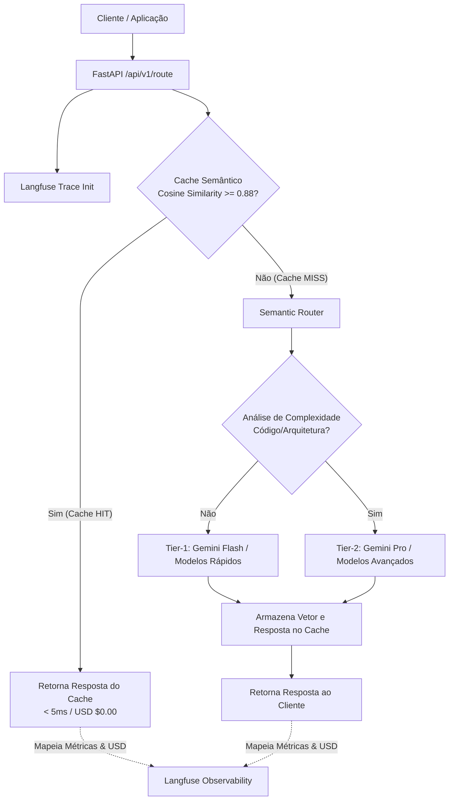

# LLM Semantic Router & Cache Engine ⚡🧠


> Middleware de alta performance para **Cache Semântico Vetorial** e **Roteamento Dinâmico de Modelos LLM** com Observabilidade Integrada no Langfuse. Reduza latência em até **98%** e economize tokens enviando requisições recorrentes diretamente do cache em sub-milissegundos (< 5ms).

---

## 🧭 Visão Geral

O **LLM Semantic Router** resolve dois grandes desafios de LLMOps em escala:
1. **Redução drástica de custos e latência via Cache Semântico**: Avalia se a intenção da mensagem atual já possui resposta equivalente pré-computada via busca por similaridade de cosseno ($\ge 0.88$). Se sim, a resposta é entregue instantaneamente sem acionar a API da LLM (**Cache HIT**).
2. **Roteamento Inteligente entre Tiers de Modelos**: Prompts simples ou de suporte casual são direcionados para modelos rápidos de baixo custo (**Tier-1 Flash**), enquanto prompts complexos (análise de código, arquitetura, raciocínio) são direcionados para modelos avançados (**Tier-2 Pro**).
3. **Observabilidade Pesada no Langfuse**: Rastreia similaridade vetorial, modelo final, tempo de execução e economia estimada em USD diretamente no painel do Langfuse.

---

## 🏗️ Arquitetura do Sistema



---

## 📊 Comparativo de Desempenho & Latência

| Estado | Latência Média | Custo Estimado / 1k Prompts | Economia de Tokens |
| :--- | :---: | :---: | :---: |
| **Cache HIT ⚡** | **< 5ms** | **$0.00 USD** | **100%** |
| **Tier-1 (Flash Model)** | ~180ms | $0.0001 USD | -- |
| **Tier-2 (Pro Model)** | ~850ms | $0.0015 USD | -- |

---

## 🧰 Stack Tecnológica e Endpoints

| Endpoint | Método | Descrição |
| :--- | :---: | :--- |
| `/api/v1/route` | `POST` | Avalia prompt, consulta cache semântico e roteia para o modelo ideal |
| `/api/v1/cache/stats` | `GET` | Retorna o Hit Ratio %, total de requisições e economia acumulada em USD |
| `/api/v1/cache` | `DELETE` | Expurga todas as entradas e estatísticas do cache semântico |
| `/health` | `GET` | Health check da aplicação e quantidade de prompts em cache |

---

## 🚀 Como Executar

### 1. Execução com Docker (Recomendado)
```bash
docker-compose up --build -d
```

### 2. Execução Local (Python 3.12)
```bash
pip install .
uvicorn app.main:app --reload --port 8000
```

---

## 🧪 Suíte de Testes Automatizados

Para executar os testes com verificação de cobertura dentro do container Docker:

```bash
docker run --rm -v $(pwd):/app -w /app python:3.12-slim bash -c "pip install pytest pytest-cov fastapi uvicorn pydantic pydantic-settings numpy langfuse httpx && pytest --cov=app --cov-report=term-missing"
```

---

## 📄 Exemplo de Uso via cURL

### 1. Primeira Chamada (Cache MISS)
```bash
curl -X POST "http://localhost:8000/api/v1/route" \
     -H "Content-Type: application/json" \
     -d '{
       "prompt": "Como configurar uma API com FastAPI e Docker?",
       "similarity_threshold": 0.88
     }'
```

### 2. Segunda Chamada Similar (Cache HIT < 5ms)
```bash
curl -X POST "http://localhost:8000/api/v1/route" \
     -H "Content-Type: application/json" \
     -d '{
       "prompt": "Como criar uma API FastAPI usando Docker?",
       "similarity_threshold": 0.88
     }'
```

### 3. Consultar Estatísticas de Economia
```bash
curl -X GET "http://localhost:8000/api/v1/cache/stats"
```

---

## 🛡️ Licença & Autor
Desenvolvido por **Cayo Neves** ([@cayoesn](https://github.com/cayoesn)) como parte do Portfólio de LLM & LLMOps de Alta Performance.


---

## 🚀 Execução em Container Isolado (100% Autônomo)

Este repositório é **100% independente e autônomo**. Ele não depende de nenhum outro projeto do ecossistema para ser executado, testado ou analisado.

### 🛠️ Componentes Inclusos na Stack Docker Exclusiva:
- `semantic_router_app`: API FastAPI de Cache Semântico e Roteador de Modelos.
- `semantic_router_redis`: Instância Redis para busca vetorial de similaridade e cache (porta 6380).
- `semantic_router_postgres`: Banco de dados PostgreSQL dedicado (porta 5435).
- `semantic_router_langfuse`: Servidor de observabilidade Langfuse self-hosted pré-inicializado.

### 📦 Como Executar:

1. **Subir toda a pilha isolada**:
   ```bash
   docker-compose up -d --build
   ```

2. **Endpoints & Endereços de Acesso**:
   - **Serviço da Aplicação**: `http://localhost:8003` (Documentação interativa OpenAPI em `/docs` se aplicável)
   - **Painel de Observabilidade (Langfuse)**: `http://localhost:3004`
   - **Credenciais Automáticas do Langfuse**:
     - Email: `admin@llmsemanticrouter.com`
     - Senha: `adminpassword123`

3. **Execução de Testes Automatizados em Container**:
   ```bash
   make test
   ```

4. **Encerrar a pilha**:
   ```bash
   docker-compose down -v
   ```
